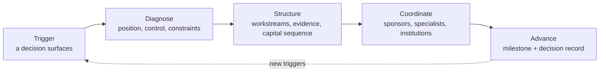
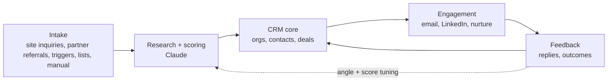
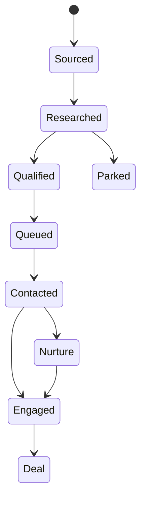

# Regenera OS — Build Spec & Operating Model (v2)

Sep 23, 2026 · @Prado

**Version 2.** This version aligns the Sep 23 spec to the live regenera.bio as of Sep 23, 2026, and to its source repository `regenera-development-office`. Every Regenera term, practice, system layer, engagement type, vocabulary list, design token and piece of infrastructure below comes from the live site or its code. Nothing is taken from the older `regenera-nextjs` design. Appendix A lists every change from v1 and where each fact came from.

---

# Part A. Product spec

## 1. Positioning: Regenera as a trigger-response development office

Regenera is a **Regenerative Development and Advisory Office**. Its public line is **"Capital aligned with living systems."** The site describes the work like this: Regenera brings project strategy, specialist expertise and capital discipline together where investment logic meets the realities of energy, land, infrastructure and resources.

Regenera OS makes the first contact repeatable. It detects the moment a counterparty holds a live decision, then opens the conversation through one of the site's two entry paths:

- **Capital mandate** for investors, funds, family offices, institutions and strategic partners. They define sector, geography, ticket, stage, structure and eligibility before projects enter review.
- **Project diagnostic** for developers, sponsors, landowners and operators. It establishes control, constraints, readiness and the work required to reach the next project decision.

**Operating thesis.** Complex projects fail at the interfaces: between site and infrastructure, concept and delivery, sponsor and counterparty, and capital requirement and supporting evidence. Every trigger (a closure obligation, a disclosure deadline, a new fund, a stalled project, a tender) is a decision someone now holds. Regenera helps them reach that decision on evidence.

**Role boundaries.** These are hard constraints on everything the OS writes. They mirror the site's Important Notice. Regenera is not an investment fund, investment bank, broker-dealer, registered investment adviser, placement agent, fund manager, custodian, engineering firm or EPC contractor, and it does not hold or manage client or investor funds. Regenera coordinates and holds the interfaces. Specialists keep their professional scope.



These four stages are the site's operating sequence (Diagnose, Structure, Coordinate, Advance). Engagements begin with a bounded diagnostic. Regenera expands its role only where the project requires continued coordination. A decision record from each stage becomes authorized case evidence for later outreach.

**Positioning line (live):** Capital aligned with living systems.
**Close line (live):** Define the mandate. Test the project.

### Engagement ladder

These rungs are the site's engagement structures. The internal keys match the Pipeline Tracker's `engagement` values in `regenera-development-office`.

| Rung | Engagement (site name) | Key | Scope (site copy) | Typical fee type (tracker vocabulary) |
|---|---|---|---|---|
| Entry | Project diagnostic | `diagnostic` | A bounded assessment of position, evidence, constraints and the next decision | One-time |
| Entry (capital side) | Capital-partner mandate / screening | `capital_screening` | Mandate definition, project screening and authorized review | One-time or milestone |
| Core | Strategy & readiness mandate | `readiness_mandate` | A defined programme for development workstreams and institutional readiness | Milestone or monthly retainer |
| Core | Development office | `development_office` | Ongoing coordination across sponsor, specialists, counterparties and milestones | Monthly retainer |
| Expansion | Capital advisory / capital process | `capital_advisory` | Frame the capital requirement and coordinate mandate-led review, when appropriate | Success fee (deal-based), where counsel confirms the structure |
| Expansion | Governance & monitoring | `governance_monitoring` | What continues to be tracked once a project is underway | Monthly retainer |
| Ownership | Co-development participation | (no tracker key yet) | Only where agreed in writing | Fee + equity |

Fee types are the tracker's `fee` values: `one_time`, `monthly_retainer`, `milestone`, `fee_plus_equity` and `success_fee`.

**What changes for Regenera.** Events drive the pipeline instead of lists. Every inbound or outbound conversation starts from a specific decision the counterparty holds now. Mandates from other platforms (RA-ESG, GWCe, future funds) plug in as separate mandates inside the same system, with their own rules (section 13).

## 2. System overview

Regenera OS is a private web app at `os.regenera.bio`. Leads and triggers enter, Claude researches and matches them, outreach goes out through Gmail and a LinkedIn queue, and every touch, reply and meeting updates the CRM automatically. Prado's daily job is approvals, flagged replies and meetings.

Regenera OS **replaces the Pipeline Tracker** now running at `regenera.bio/tracker` (section 19). The tracker's stages, engagement types, fee types and lead sources carry over as the OS vocabulary.

### Stack (matches the live regenera.bio stack)

| Layer | Choice | Role |
|---|---|---|
| Frontend | Next.js 16 App Router + React 19 + TypeScript, built with **vinext** for Cloudflare Workers (same toolchain as `regenera-development-office`) | App UI, behind login |
| Hosting | **A second managed Sites project**, the same platform that publishes regenera.bio (`.openai/hosting.json`), on a Cloudflare Worker | App, API routes, server actions, job runner |
| Database | **D1** (SQLite) through the Sites `d1` binding, with **Drizzle ORM** and drizzle-kit migrations. A separate database from the site's | CRM data |
| Jobs | A **D1-backed job table** drained by a protected `POST /api/jobs/tick` endpoint. A **scheduler** calls it every 5 minutes (section 23) | Automation engine |
| Files | **R2** through the Sites `r2` binding | Imports, proposal attachments, snapshots |
| Sign-in | Sites "Sign in with ChatGPT" plus a server-side email allowlist (`mandate_members`) | App access |
| Intelligence | Anthropic API | Research, scoring, matching, drafting, reply triage, reports |
| Email (outreach) | Gmail API (Workspace internal app), subject to open decision (section 27) | Send, thread, read replies |
| Email (system) | **Resend** from `mail.regenera.bio`, as the site already uses | Daily digest, alerts, notifications |
| Calendar / files | Google Calendar and Drive APIs | Meetings to deals, proposals to records |
| Booking | Existing Google appointment schedule `https://calendar.app.google/FDK2Hz8rs3VpZSRp7` (the site's "Schedule a scoping call" link) | Link in interested-reply drafts |
| Prospect data | **Apollo.io API on the free plan** (decided Sep 23, 2026: no paid Apollo subscription) plus public sources | Net-new people and company search (0 credits), person and company enrichment with email verification (credits), job postings and news for triggers |
| Web research | Anthropic API web search tool + page fetch | Contact and firm websites, news triggers |
| LinkedIn | Assisted queue (phase 1), optional Unipile API later | Connection notes, messages |

**Why a second Sites project.** It is the same platform, toolchain and deploy flow as regenera.bio, with no new hosting account. The OS stays a separate project with its own D1 database, so neither project can break the other. What the platform exposes is D1, R2 and platform sign-in. Its config has no Queue or Cron Trigger bindings, so the job engine is designed not to need them.

**No Supabase.** Regenera infrastructure runs on Cloudflare-based hosting. The OS must not provision or connect to any Supabase project, including the existing investor-intelligence project, which is out of scope.

### Five layers



### Lead lifecycle



Once a contact is Engaged, a deal is created and follows the deal stages in section 9. Every transition is logged with a timestamp and a cause (job, reply classification, calendar event or manual).

## 3. Target segments

There are 24 segments across five groups. Each is stored as a config record so new segments can be added without code. Every segment carries its **engagement path** (capital mandate or project diagnostic), which mirrors the site's two entries. Every segment also maps to one or more of the site's **five sectors**: Energy; Infrastructure; Land & Built Environment; Waste & Resource Systems; and Water, Food & Nature. Entry offers are working drafts for Prado to finalize, and each is phrased as a site engagement.

| Group | Segment | Path | Target titles | Core triggers | Practice match | Entry offer (draft) |
|---|---|---|---|---|---|---|
| Capital | Impact family offices | Capital mandate | CIO, Head of Impact, Principal | New allocation, next-gen succession, new hire | Capital & Strategic Partnerships | Mandate definition session |
| Capital | DFIs and multilaterals | Capital mandate | Investment Officer, Sector Lead | New facility or call for proposals, country strategy | Capital & Strategic Partnerships | Screening briefing on mandate-fit projects |
| Capital | Blended finance vehicles | Capital mandate | Fund Manager, Structuring Lead | Fund launch, first close, concessional tranche | Capital & Strategic Partnerships | Capital-sequencing screen |
| Capital | Natural capital and regen ag funds | Capital mandate | Partner, Investment Director | Fundraise, new strategy, deployment pressure | Capital & Strategic Partnerships | Mandate brief and screening record |
| Capital | Foundations (PRI/MRI) | Capital mandate | Program Officer, Impact Investing Director | New strategy, endowment alignment | Capital & Strategic Partnerships | Mandate definition session |
| Capital | Pensions and insurers | Capital mandate | Head of Sustainable Investment | Net-zero or nature commitment, regulation | Capital & Strategic Partnerships | Real-asset mandate brief |
| Capital | Sovereign and state funds (MENA) | Capital mandate | Director Sustainability, Real Assets | National programmes, giga-projects | Capital & Strategic Partnerships + Systems Intelligence | Territorial opportunity briefing |
| Corporate | Post-industrial land and site rehabilitation (was "Mining") | Project diagnostic | Closure Manager, VP Environment, Land Manager | Closure plan, rehabilitation obligation, land repurposing | Systems Intelligence + Development & Strategy | Project diagnostic (land repurposing) |
| Corporate | Agribusiness | Project diagnostic | Head of Sourcing, Sustainability Director | Deforestation rules, buyer demands, soil loss | Systems Intelligence | Productive-landscape diagnostic |
| Corporate | Food and consumer brands | Project diagnostic | CSO, Head of Regenerative Sourcing | Public sourcing commitment, scope 3 targets | Development & Strategy | Commitment-to-programme diagnostic |
| Corporate | Real estate developers and REITs | Project diagnostic | Head of Development, ESG Director | Land acquisition, entitlement, green finance need | Development & Strategy | Site and watershed diagnostic |
| Corporate | Energy and utilities | Project diagnostic | Head of Development, Land Manager | Project pipeline, interconnection delay, land-use conflict, community opposition | Systems Intelligence + Development & Strategy | Project diagnostic (site, grid, land) |
| Corporate | Hospitality and tourism | Project diagnostic | Owner, Development Director | New resort or destination, certification | Development & Strategy | Destination project diagnostic |
| Corporate | Industrials and manufacturers | Project diagnostic | Plant Director, CSO | Waste costs, water stress, disclosure | Systems Intelligence | Waste & resource systems diagnostic |
| Public | Municipalities | Project diagnostic | Mayor's office, Public Works, Environment Director | Landfill closure or crisis, tender, disaster | Systems Intelligence | Municipal systems diagnostic |
| Public | National ministries | Project diagnostic | Environment, Agriculture, Energy officials | New policy, donor programme, NDC update | Development & Strategy + Capital & Strategic Partnerships | Programme readiness concept |
| Public | SEZs and development authorities | Project diagnostic | CEO, Investment Promotion Head | New zone, investor push | Systems Intelligence + Development & Strategy | Zone territorial diagnostic |
| Public | Tourism authorities | Project diagnostic | Director General, Planning Head | Overtourism, new destination plan | Systems Intelligence | Destination territorial framework |
| Channel | EPC and engineering firms | Partner Network | BD Director, Head of Sustainability | Bid on relevant project, new market entry | Development & Strategy | Partner Network invitation (Institutional tier) |
| Channel | ESG law practices | Partner Network | Partner, Counsel | Client disclosure work, new regulation | Referral | Partner Network invitation |
| Channel | Big 4 sustainability teams | Partner Network | Director, Partner | Client gap in development expertise | Subcontracted specialist | Specialist capability brief |
| Channel | Architects and planners | Partner Network | Principal, Design Director | Large masterplan win | Systems Intelligence | Joint territorial concept |
| Channel | Banks and institutional lenders | Partner Network | Relationship Manager, Project Finance Director | Sourcing bankable projects | Capital & Strategic Partnerships | Partner Network invitation (Institutional tier) |
| Community | Large landholders and ranches | Project diagnostic | Owner, Estate Manager | Succession, land degradation, carbon interest | Systems Intelligence | Productive-landscape diagnostic |
| Community | Indigenous and community land trusts, conservation NGOs | Project diagnostic | Director, Finance Lead | Funding gap, land-rights win, programme launch | Capital & Strategic Partnerships | Financing pathways session |

Channel segments route into the **Partner Network** (`regenera.bio/partners`). Its tiers are Standard (10% of engagement fee, all approved partners), Strategic (15%, 3+ signed mandates in 12 months) and Institutional (20%, banks, funds and EPC firms). The v1 channel list has gained "Banks and institutional lenders", because the Partner Network already targets them.

**Mining.** The live site removed mining from all client-facing content. That segment is renamed "Post-industrial land and site rehabilitation" and seeded **disabled** until Prado confirms (section 27).

Each segment record also stores its message angle, proof assets, languages, regions and send-time rules.

## 4. Trigger engine

The trigger engine is the core of Regenera OS. It scans news, filings, tenders, job moves and public lists daily. It turns each event into a structured trigger, links it to an organization, and proposes the decision framing before anyone else calls.

### Trigger taxonomy

| Type | Examples | Response window | Typical segments |
|---|---|---|---|
| People | New CSO, Head of Impact or CIO; next generation takes over a family office | 30–60 days | All |
| Capital | Fund launch, first close, new facility, call for proposals | 14–45 days | Capital, Channel |
| Regulatory | New disclosure rule, deforestation rules, closure obligations | 60–120 days before deadline | Corporate, Public |
| Crisis | Landfill failure, drought, flood, contamination, community conflict | 7–30 days | Public, Corporate |
| Project | Land acquisition, masterplan award, EPC bid, entitlement, interconnection queue delay | 14–60 days | Corporate, Channel |
| Procurement | Consulting tender, EOI, RFP | Before deadline | Public, Capital |
| Commitment | Net-zero, nature-positive or sourcing pledge | 30–90 days | Corporate, Capital |
| Event | Conference speaker or exhibitor list | 14 days before, 48 hours after | All |

### Detection sources

- **News and alerts:** search API queries run daily per trigger type and region (section 5), plus Google Alerts delivered to a dedicated inbox the app reads.
- **Tenders:** UNGM, World Bank, IDB, AfDB and ADB procurement notices, Devex, EU TED and national portals.
- **People moves:** Sales Navigator saved searches with job-change filters, exported weekly.
- **Public lists:** TNFD adopters, SBTi dashboard, PRI signatories, GIIN members and CDP disclosers, refreshed monthly and diffed for new entries.
- **Internal:** regenera.bio inquiries, Partner Network referrals, replies that mention new projects, and meeting notes.

### Processing (per trigger)

1. Claude extracts the organization, event, date, location, source link and urgency.
2. It matches the event to an existing organization or creates one, then identifies the likely decision-makers.
3. It writes a one-paragraph **decision read**: the decision the event puts in front of them, the conditions and constraints most likely in play, and which entry path fits.
4. It scores urgency and fit, then routes the lead. High scores go to the targeted tier and the rest to the mass tier or watchlist.
5. The opener references the trigger directly, for example "your closure plan filing", "the new fund" or "the landfill tender".

**Trigger feed screen.** A live feed of new triggers. Each shows its decision read, linked organization, suggested contacts and a one-click action: pursue, watch or dismiss. Dismiss reasons tune future scoring.

## 5. Prospecting funnels and key searches

Ten funnels feed the CRM. Each is tagged as the lead's source so conversion can be compared. The source values extend the tracker's lead sources (`website`, `organic`, `linkedin`, `google`, `referral`, `email`, `event`, `other`).

| Funnel | Source value | What it captures | Tier |
|---|---|---|---|
| Trigger | `trigger` | Organizations where an event just created a decision | Targeted |
| Mandate match | `mandate_match` | Allocators and operators whose mandate overlaps a practice | Targeted |
| Procurement | `procurement` | Tenders and EOIs from governments and multilaterals | Targeted |
| Compliance-driven corporate | `compliance` | Firms facing disclosure or supply-chain pressure | Mass, then targeted on reply |
| Partner Network | `referral` | Referrals submitted by approved partners at regenera.bio/partners | Auto-qualified |
| Channel recruitment | `channel` | EPCs, law firms, Big 4, architects, banks, fund managers | Targeted |
| Warm network | `organic` | Introductions through existing relationships | Manual, introduction asks |
| Inbound | `website` | regenera.bio inquiry form (capital mandate and project diagnostic) | Auto-qualified |
| Event | `event` | Speaker, exhibitor and attendee lists | Mass before, targeted after |
| Apollo search | `apollo` | Net-new people and companies found with the segment's saved Apollo filters (titles, seniority, locations, industries, headcount) | Mass by default; targeted when a trigger or mandate match exists |

### Apollo saved searches

Each segment in section 3 stores an Apollo filter set: `person_titles[]`, `person_seniorities[]`, `person_locations[]`, `organization_locations[]`, industry keywords and headcount ranges. These mirror the Sales Navigator Booleans below. Running one is free, because search uses 0 credits. Only people Prado saves or bulk-selects are enriched, which is what spends credits.

### Sales Navigator (Boolean on title)

- **Sustainability leaders:** `("Chief Sustainability Officer" OR "Head of Sustainability" OR "Head of ESG" OR "Director of Sustainability" OR "VP Environment")` + industry filter + region + "changed jobs in past 90 days"
- **Impact capital:** `("Investment Director" OR Principal OR CIO OR Partner) AND (impact OR "natural capital" OR regenerative OR "blended finance" OR "nature-based" OR "real assets" OR infrastructure)` + industry Venture Capital & Private Equity or Investment Management
- **Family offices:** company keyword "family office" + title `(CIO OR "Head of Investments" OR Principal)` + keyword `(impact OR sustainability OR regenerative OR "real assets")`
- **Site rehabilitation:** `("Closure Manager" OR "Mine Closure" OR "Rehabilitation" OR "Environmental Manager" OR "Land Manager")` + Mining or Utilities industry. Disabled until the segment is confirmed.
- **Agri sourcing:** `("Head of Sourcing" OR "Sustainable Sourcing" OR "Regenerative Agriculture")` + Food & Beverage or Farming
- **Municipal:** `("Director of Public Works" OR "Environmental Services" OR "Solid Waste" OR "Chief Resilience Officer")` + Government Administration
- **EPC partners:** `("Business Development Director" OR "Head of Sustainability")` + Civil Engineering or Construction + keyword `(renewable OR waste OR water OR grid)`
- **Energy developers:** `("Head of Development" OR "Development Director" OR "Land Manager")` + Renewables & Environment + keyword `(interconnection OR "land acquisition" OR offshore)`

### Google X-ray

- `site:linkedin.com/in "head of sustainability" (energy OR infrastructure) (Chile OR Peru OR "South Africa" OR Ghana)`
- `site:linkedin.com/in "family office" ("real assets" OR impact OR regenerative) (Miami OR "Mexico City" OR "São Paulo" OR Dubai)`
- `"appointed" ("chief sustainability officer" OR "head of impact") 2026`
- `("natural capital fund" OR "regenerative agriculture fund" OR "infrastructure fund") ("first close" OR launch) 2026`
- `(landfill OR "waste management") (tender OR crisis OR closure) [city or country]`
- `"interconnection queue" (delay OR backlog) [market]`
- `"call for proposals" ("nature-based solutions" OR "circular economy" OR "water infrastructure")`

### Public lists (monthly diff for new entries)

TNFD adopters, SBTi target dashboard, PRI signatories, GIIN members, B Corp directory, CDP disclosers, ImpactAssets 50, foundation PRI/MRI lists, and climate, energy and infrastructure conference speaker lists.

### Standing alerts (daily)

- natural capital fund launch
- infrastructure fund first close
- land restoration financing
- waste tender [city]
- interconnection queue [market]
- new chief sustainability officer
- blended finance facility launch
- drought water crisis [region]
- desalination tender [country]

All searches are stored in the app as saved queries with an owner segment, region and cadence, so they can be edited without code.

## 6. Deep contact intelligence

Every targeted-tier lead gets a dossier built from the organization's website, filings, press, portfolio pages and the contact's LinkedIn profile. Outreach is written from that dossier, never from a template alone.

### Research job (per organization and contact)

1. Crawl the firm website: about, strategy or thesis, portfolio or projects, news, team, sustainability report and careers.
2. Pull news and filings from the last 12 months, plus tenders and procurement history for public bodies.
3. Read the contact's LinkedIn profile: role, tenure, prior roles, and the posts and topics they engage with.
4. Map their ecosystem: co-investors, EPCs and engineering partners, advisors, lenders and government counterparts.
5. Add country context from the regenera.bio country intelligence dataset (`countries`, `country_indicators`: screening-grade indicators with source and licence). This data is only a backdrop, never a claim about the project itself.
6. Claude synthesizes the dossier and cites a source link for every claim.

**LinkedIn data, handled safely.** LinkedIn prohibits automated scraping. Profile data enters in three ways:

- fields in Sales Navigator exports
- a one-click browser extension Prado uses on a profile he is already viewing, which sends that page to the app
- a manual paste

The app never crawls LinkedIn on its own.

### Dossier fields

The fields use the site's own vocabulary: the six mandate parameters from the Capital Partners page, and the five readiness dimensions from the Project Sponsors page.

| Field | Content |
|---|---|
| Mandate | What they are mandated to do, in their words |
| Mandate parameters (capital path) | Sector, Geography, Capital (ticket range, currency, allocation capacity, timing), Stage (Formation, Development, Construction, Operating, Expansion), Structure (Equity, Debt, Project Finance, Strategic, Blended), Eligibility |
| Readiness position (diagnostic path) | Control, Technical, Commercial, Institutional and Capital, each with evidence notes |
| Development mandate | For DFIs, governments and corporates: programmes, targets and obligations |
| Recent activity | Last 3–5 deals, projects, tenders or announcements, dated |
| Live opportunities | Open tenders, stated pipeline gaps, projects seeking partners |
| Partner ecosystem | EPCs, co-investors, advisors, government counterparts |
| Decision map | The contact's role, other stakeholders, the likely decision authority |
| Trigger | The current event, linked to section 4 |
| Decision read | The decision they hold and the conditions governing it, in one paragraph |
| Systems in play | Which of the seven territorial systems are material (section 7) |
| Engagement match | Practice, engagement rung and entry offer |
| Personalization hooks | Posts, talks, quotes, shared connections, shared geography |
| Risks and conflicts | Overlap with other mandates, sensitivities, compliance flags |
| Confidence | High, medium or low, with sources |

**Partner mapping.** For every project-type lead, the app lists the EPCs, engineers and operators active on similar projects in that geography. They become Partner Network prospects or co-bid partners, which is how one client lead grows into a consortium. This matches the site's "access built through the work itself".

**Refresh.** Dossiers refresh when a new trigger hits the organization, before a meeting, and every 90 days for active deals.

## 7. Scoring, matching and engagement ladder

Each lead is scored 0–100 on three axes and routed by the total. The weights live in settings, and outcome data proposes adjustments monthly.

| Axis | Weight | Scored on |
|---|---|---|
| Fit | 40% | Mandate overlap with a practice and sector, geography, ticket or budget size, stage |
| Trigger | 35% | Trigger present, recency, urgency, deadline proximity |
| Access | 25% | Warm path, Partner Network referral, shared connection, prior touch, cold |

### Routing

| Score | Route | Handling |
|---|---|---|
| 75–100 | Targeted tier | Full dossier, bespoke sequence, individual review |
| 50–74 | Mass tier | Light research, segment-level personalization, batch review |
| 30–49 | Watchlist | No outreach; re-scored when a trigger hits |
| Under 30 | Parked | Stored, excluded from outreach |

**Screening matrix for qualified deals.** Once a deal is past first contact, the OS applies the site's screening logic. Readiness and mandate fit are separate tests, and project evidence cannot compensate for mandate misalignment.

| | Low alignment | High alignment |
|---|---|---|
| **High readiness** | Redirect: strong project, wrong mandate | Proceed: prepare authorized review |
| **Low readiness** | Decline: no credible basis to proceed | Develop: resolve material gaps first |

**Matching.** Claude assigns each lead an engagement path, a primary practice, an entry offer and an angle from the segment config, plus a secondary option. Prado can override; overrides are logged and used to improve matching. The vocabulary is the live site's:

- **Three practices:** 01 Systems Intelligence, 02 Development & Strategy, 03 Capital & Strategic Partnerships.
- **Five sectors (systems of focus):** Energy; Infrastructure; Land & Built Environment; Waste & Resource Systems; Water, Food & Nature.
- **Seven territorial systems:** 01 Land & Stewardship, 02 Water, 03 Energy & Resource Flows, 04 Food & Production, 05 Community & Health, 06 Built Environment, 07 Information & Governance.
- **Four method gates:** Basis to proceed, Development case, Institutional readiness, Capital and delivery.

**Engagement ladder per segment.** Each segment carries three rungs from section 1: entry (diagnostic or capital-partner screening), core (readiness mandate or development office) and expansion (capital advisory, governance and monitoring, co-development). Outreach only ever sells the entry rung or a conversation. The CRM tracks which rung each deal is on.

**Conflict check.** Before a lead is queued, it is checked against every mandate, every existing relationship and every Partner Network referral. Matches are flagged for Prado's decision, never sent automatically.

## 8. Outreach engine

Outreach runs in two tiers (mass and targeted) over three channels (email, LinkedIn and nurture). Everything passes an approval gate except follow-ups on already-approved advisory sequences.

| | Mass tier | Targeted tier |
|---|---|---|
| Volume | 30–50 new contacts a day per sending domain | 5–15 a week |
| Research | Firm website + trigger | Full dossier (section 6) |
| Personalization | First line and angle per contact, body per segment | Fully bespoke; references mandate, deals and trigger |
| Review | Batch approve, spot-check | Every message read and edited |
| Sender | Secondary domain | regenera.bio |
| Channels | Email, then LinkedIn if opened | LinkedIn first or a warm introduction, then email |

### Default sequences

| Step | Mass tier | Targeted tier |
|---|---|---|
| Day 0 | Email 1: trigger or mandate hook, one-line decision read, entry offer | LinkedIn connection note referencing a specific thing |
| Day 2 | LinkedIn connection note | Email 1: bespoke decision read + entry offer |
| Day 5 | Email 2: authorized proof asset relevant to segment | LinkedIn message: relevant Field Note or insight |
| Day 12 | Email 3: different angle or question | Email 2: proof asset + specific next step (scoping call link) |
| Day 21 | Breakup email, move to nurture | Personal note or introduction ask |

### Message rules for Claude

- Open with their situation and the decision they hold, not with Regenera.
- Include one specific reference from the dossier.
- State one concrete idea about conditions, constraints or sequencing.
- Make one small ask: a scoping call, or sharing mandate criteria.
- Keep email under 120 words, and connection requests within LinkedIn's note limit.
- Write in the contact's language.
- No attachments on first touch.
- Regenera house style applies to every generated message (section 25).

**Nurture track.** "Not now" and breakup contacts get a useful touch roughly every 90 days: a relevant Field Notes post (section 25 lists the current library), a market note, a relevant deal or tender, or an event invitation. Any new trigger on their organization pulls them back into an active sequence.

**Approval queue.** Drafts are grouped by tier and segment. The actions per draft are approve, edit, regenerate with a different angle, skip, or park the contact. Bulk approve applies to the mass tier only.

**Hard gates.**

- Anything under an investment mandate (fund raises, capital introduction for a fund) is manual only, with no mass tier and no automatic follow-ups.
- Capital-path outreach never implies committed capital, a marketplace, or an offer of securities (section 13).
- Every send requires an active consent and suppression check first.

## 9. CRM data model

Tables live in **Cloudflare D1**, are defined in Drizzle (`db/schema.ts`) and are migrated with drizzle-kit, following the same conventions as `regenera-development-office`. Every table carries `id`, `created_at` and `updated_at`, and every mandate-scoped table also carries `mandate_id`.

**Access isolation.** D1 has no row-level security, so mandate isolation is enforced in a single required data-access layer (`lib/db/scoped.ts`). Every query on a mandate-scoped table goes through a helper that injects `mandate_id IN (member mandates)`. Direct `db.select()` on those tables is forbidden by lint rule and by tests.

| Table | Key fields |
|---|---|
| mandates | name (Regenera, RA-ESG, GWCe…), type, sending identity, rules (mass allowed, approval required), fee terms |
| segments | group, name, engagement path, sectors[], titles, triggers, practice match, entry offer, angle, languages, regions, send windows, enabled |
| organizations | name, type, segment_id, country (ISO3, joins `countries`), website, domain, size, mandate summary, investment focus, ticket range, dossier_id |
| contacts | org_id, name, title, role band, email, email_status, linkedin_url, language, timezone, role in decision map, consent basis, suppressed |
| dossiers | org_id, contact_id, fields from section 6 (JSON), sources (JSON), confidence, refreshed_at |
| triggers | org_id, type, summary, event_date, source_url, urgency, decision_read, status, dismiss_reason |
| scores | contact_id, fit, trigger, access, total, tier, screening_quadrant, scored_at, model_version |
| deals | org_id, primary contact, mandate_id, path, stage, practice, engagement, fee_type, value estimate, probability, next_action, next_action_date, lost_reason, source, legacy_pipeline_entry_id |
| sequences | name, tier, segment_id, steps (JSON: day, channel, template, angle) |
| enrollments | contact_id, sequence_id, current step, status, stop_reason |
| messages | contact_id, channel, direction, subject, body, angle_tag, variant_id, status, gmail_thread_id, sent_at |
| replies | message_id, body, classification, sentiment, suggested_response, handled |
| activities | contact_id, deal_id, type (meeting, call, note, LinkedIn action, stage change), detail, method, source (job, calendar, manual, site) |
| partners | org_id, type, geographies, capabilities, relationship status, partner_tier (standard, strategic, institutional), site_partner_account_id |
| referrals | partner_id, referred org and contact, path, sector, context, tier, status (submitted, scoped, mandate_signed, paid, declined), site_referral_id |
| inquiries | mirror of site inquiries: kind, audience type, role, sector, geography, stage, ticket, structure, summary, consent, site_inquiry_id |
| saved_searches | funnel, query, source, segment_id, region, cadence, last_run |
| imports | file (R2 key), source, row count, dedupe results, status |
| suppression | email or domain, reason (unsubscribe, bounce, conflict, legal), added_at |

**Deal stages.** These extend the Pipeline Tracker's stages so existing records map one to one:

| OS stage | Tracker stage it maps from |
|---|---|
| lead | lead |
| contacted | (new) |
| engaged | (new) |
| call_booked | call_booked |
| proposal | proposal |
| signed | signed |
| active | active |
| expansion | renewed |
| completed | completed |
| churned | churned |
| lost | lost |
| nurture | (new) |

**Dedupe rules.** Contacts match on email, then LinkedIn URL, then name plus organization. Organizations match on domain, then normalized name. Merges keep the full history.

## 10. Automation jobs and rules

Eleven scheduled jobs run the machine. Prado only touches the approval queue, flagged replies and meetings.

| Job | Cadence | Does |
|---|---|---|
| Trigger scan | Daily 06:00 ET | Runs saved searches and alerts, extracts triggers, links organizations |
| Site sync | On webhook + hourly reconcile | Pulls new regenera.bio inquiries and Partner Network referrals (section 24) |
| List diff | Monthly | Refreshes public lists, flags new entrants |
| Import processor | On upload | Parses, dedupes, enriches, creates records |
| Research | Continuous queue | Builds dossiers for new leads by tier |
| Scoring and matching | After research | Scores, routes, assigns path, practice, engagement and angle; runs the conflict check |
| Drafting | After scoring | Drafts sequence messages into the approval queue |
| Sender | Every 15 min | Sends approved messages inside recipient send windows, within domain caps |
| Reply watcher | Every 10 min | Reads Gmail, matches threads, classifies, pauses sequences, drafts responses |
| Calendar sync | Every 30 min | Logs meetings to deals, moves the stage to call_booked, schedules the pre-meeting brief |
| Daily digest | Daily 07:00 ET | Emails Prado (via Resend): new triggers, queue size, replies to handle, overdue next actions, new inquiries and referrals |

### Rules

- **Any reply:** stops the sequence for that contact and every other contact at the same organization.
- **Interested reply:** the stage becomes engaged, a response is drafted with the scoping-call link, and the reply is flagged high priority.
- **Not now:** move to nurture with a 90-day touch; any new trigger reactivates.
- **Referral:** create the new contact, link the referrer, draft an introduction-based opener.
- **Unsubscribe or hostile:** suppress the address, and for an explicit organizational request, the domain.
- **Bounce:** mark the email invalid, try enrichment once more, otherwise switch to LinkedIn only.
- **Meeting booked:** generate a brief from the dossier 24 hours before. After the meeting, prompt for notes and a next action.
- **Open deal with no next action date:** flag it in the digest.
- **Partner Network referral whose status moves to `mandate_signed`:** create or advance the linked deal to signed and log the partner tier for fee calculation.

Daily send caps per domain ramp up during warm-up, and pause automatically if the bounce rate exceeds 3% or spam complaints appear.

## 11. UX and UI

**Apollo.io's layout and working patterns, in Regenera's brand** (decided Sep 23, 2026). The OS works like Apollo: a searchable database of people and companies, dense tables with a filter panel, saved lists, bulk actions and sequences. It looks like regenera.bio: the same tokens, typeface and gold wordmark. The daily rhythm is still about 15 minutes (section 16). The density is there for the weekly prospecting and list-building sessions.

### Shell

- **Header:** fern (`--fern`), full width, continuous with the sidebar, with the gold REGENERA wordmark. Global search sits here (phase 1), with the account menu on the right. Decided Sep 23, 2026: only the header and sidebar are green; the work area is always white.
- **Sidebar:** fern (`--fern`), fixed on the left under the header. Nav groups use Apollo's structure in Regenera's vocabulary:
  - **Home**, **Map**
  - **Prospect:** People, Companies, Lists, Triggers
  - **Engage:** Sequences, Approval queue, Tasks, Inbox
  - **Win:** Deals, Partners, Reports
  - **Settings** at the foot

  The active item gets a pollen marker.
- **Responsive:** icon rail between 821 and 1100px. On a phone, the fern header with a menu button and the fern menu dropping down beneath it.

### Screens

| Screen | Apollo equivalent | Key elements |
|---|---|---|
| Map | (no Apollo equivalent) | A Google Earth Pro style globe: satellite imagery (Esri World Imagery with a free ArcGIS key, or NASA Blue Marble relief without one), 3D terrain (AWS terrain tiles), gold country borders and labels (OpenFreeMap). Layers: organizations by sector, deals, this year's triggers, open tenders and EOIs, and live GDACS hazards. Search, fly-to, a detail panel with the decision read and source, and a globe or flat toggle |
| Home | Home | Queue count, replies to handle, meetings today with briefs, overdue actions and tasks, top 5 new triggers, new site inquiries and referrals |
| People | People search | **Two tabs:** "Saved" (people in the OS) and "Find in Apollo" (net-new via the Apollo API, section 12). Filter panel on the left: segment, sector, region, title, seniority, tier, score, trigger, email status, list, stage. The table has a checkbox column, customizable columns and sorting. **Bulk actions:** save, add to list, enrich, research, score, add to sequence, export. Clicking a row opens a side panel preview. Import CSV |
| Companies | Companies search | The same pattern for organizations: sector, region, segment, mandate parameters (ticket, stage, structure), trigger history, headcount, and people at the company |
| Lists | Lists | Static lists and saved searches (a filter set with its own count), usable as sequence audiences |
| Triggers | (no Apollo equivalent) | Trigger cards with decision read, organization and suggested contacts. Pursue, watch or dismiss |
| Sequences | Sequences | Steps, audiences, stats per step and per angle, pause and resume. Mass and targeted defaults from section 8 |
| Approval queue | (Apollo manual email tasks) | Draft cards grouped by tier. Approve, edit, regenerate angle or skip. Bulk approve for the mass tier only |
| Tasks | Tasks | LinkedIn steps, calls, follow-ups and next actions due, filterable by type and due date |
| Inbox | Emails / Conversations | Threads with classification, dossier sidebar, suggested reply and one-click send |
| Deals | Deals | Kanban and table views by stage. Filters for mandate, path, segment, sector, region and engagement. Drag to move. Success-fee and partner-fee calculator carried over from the tracker |
| Person / Company record | Contact / Account page | **Header:** name, title, org, score chip, tier and quick actions (email, sequence, add to list, research). **Tabs:** Overview (dossier with sources), Activity (timeline), Deals, Emails, Notes. Readiness or mandate parameters in a right-hand panel |
| Partners | (no Apollo equivalent) | Partner Network by tier and geography, referrals and their status, linked projects, co-bid history |
| Reports | Analytics | Funnel conversion, reply and meeting rates by segment, angle and tier, forecast and weekly summary |
| Settings | Settings | Mandates, segments, sequences, offers, scoring weights, mailboxes and send caps, Apollo connection and credit budget, prompts, members, jobs |

### Interaction patterns

- **Filter panel + table** is the core pattern: filters on the left, results in the table and an active-filter chip row above it. Every filter state has a shareable URL and can be saved as a list.
- **Row selection + bulk action bar:** select rows, and a bar appears with the actions allowed for that selection. Investment-mandate records never offer mass or sequence actions.
- **Side panel preview:** a row opens a right-hand panel (dossier summary, score "why", last touches, quick actions) without leaving the table. "Open" goes to the full record.
- **Credit awareness:** any action that spends Apollo credits (enrich, reveal) shows the estimated credits before it runs, and the month's remaining budget.
- **Ask the OS:** a command bar (Cmd+K, built on `cmdk`) where Prado types plain requests. Examples: "show family offices in LatAm with a trigger this month", or "draft a follow-up to everyone who opened the energy developers sequence." Claude executes against the database.
- **Keyboard-first queue:** A approves, E edits, R regenerates, S skips, and the arrow keys move between drafts.
- **Explainability:** every score, match and classification shows a "why" line with sources.
- **Mobile triage:** Home, Inbox, Approval queue and records work fully on a phone. Tables collapse to cards. Configuration is desktop only.
- **Undo window:** a 60-second unsend on every approved message before it leaves the queue.

**Design system (live regenera.bio).** The app copies the tokens from `regenera-development-office/app/globals.css`:

| Token | Value | Use in the OS |
|---|---|---|
| `--paper` / `--white` | `#ffffff` | Page ground |
| `--ink` | `#0d120e` | Body text |
| `--fern` | `#131b13` | Headings, primary surfaces, dark bands |
| `--leaf` | `#7a8675` | Eyebrows, secondary text |
| `--reed` | `#a9c799` | Positive states, "Proceed" quadrant |
| `--water` | `#476b5e` | Links, informational states |
| `--wax` | `#efe9dc` | Card and panel fills |
| `--pollen` | `#c9a84d` | Primary actions and urgency highlights only (matches site CTAs) |
| `--line` | `rgba(13,18,14,.18)` | Rules and borders |

- **Typography.** Helvetica Neue (fallback Helvetica, Arial), body 16px/1.45. Headings are weight 600 with tight tracking (`-.055em` for display sizes). Eyebrows are 12px uppercase, `.16em` tracking, weight 700, in `--leaf`.
- **Components.** Pill buttons (`border-radius: 999px`), with pollen fill for primary actions. 1px `--line` rules instead of heavy shadows. Icons are `lucide-react`, the set the site already uses. Tables are compact (36px rows, 13px text) for Apollo-level density; page and record chrome keeps the site's spacing.
- **Styling approach.** Global tokens in `styles/tokens.css`, plus CSS Modules per screen, the same pattern as `app/tracker/tracker.module.css` and `app/partners/partners.module.css` on the site.
- **Light only.** Like regenera.bio, the work area is always white regardless of the viewer's system theme. Only the header and sidebar are fern. The Map is the one dark surface, because it shows space around the globe.
- **Colour meaning.** Trigger urgency and deal stages get consistent colour tokens that never rely on colour alone.

## 12. Integrations and connectivity

Gmail, Calendar and Drive connect through one Google login. LinkedIn is the only integration with a real policy constraint.

| Integration | Method | Notes |
|---|---|---|
| Gmail | Gmail API, OAuth, internal app in Regenera's Google Workspace | Avoids Google's external verification; separate connections per sending domain |
| Google Calendar | Calendar API | Meetings matched to contacts by attendee email |
| Booking | Existing Google appointment schedule (`calendar.app.google/FDK2Hz8rs3VpZSRp7`) | The same link as the site's "Schedule a scoping call" |
| Google Drive | Drive API | Proposals, decks and data rooms linked to deals |
| Resend | HTTP API, `mail.regenera.bio` | System email only (digest, alerts). Never used for outreach |
| LinkedIn (phase 1) | Assisted queue + browser extension | App drafts the note and opens the profile; Prado sends; extension logs the action back |
| LinkedIn (optional, later) | Unipile or similar API | Full automation; account restriction risk accepted knowingly, low daily limits |
| Sales Navigator | CSV export import | Weekly saved-search exports feed prospecting and people triggers |
| Apollo.io | REST API (`api.apollo.io/api/v1`), API key in `x-api-key` header, server-side only | **People API Search** (`mixed_people/api_search`) and **Organization Search** cost 0 credits but return no emails or phones. **People Enrichment** (`people/match`, bulk up to 10 per call) costs 1 credit when an email or demographics are found, plus 8 if a mobile number is revealed; 0 when nothing is found. Organization enrichment and job postings feed firmographics and triggers. Rate limits are per team and per endpoint. **The OS runs on the free plan**, which needs an Apollo account registered with a work email. Its limits are 50 requests per minute, 200 per hour and 600 per day for search, and the same for single enrichment (bulk: 20 per minute, 100 per hour). Enrichment is limited to the free plan's monthly credits. The OS never tries to exceed or work around these limits: no multiple accounts and no scraping of Apollo. Beyond them, prospect data comes from public sources (company websites, filings, news, public lists) through the research job. The OS enforces a monthly credit budget, never reveals mobile numbers by default, and stores each Apollo ID for dedupe. Apollo's own sequences, CRM records and mailboxes are not used |
| Web research | Anthropic API web search tool + page fetch | Dossiers and trigger scan |
| Anthropic API | Server-side only | Research, scoring, drafting, triage, reports; prompts versioned in the database |
| regenera.bio site | Signed webhook from the site + authenticated reconcile endpoint | Inquiries (`/api/inquiries`) and Partner Network referrals flow into the OS (section 24) |
| Claude chat | Regenera OS MCP server on a Worker | Query and update the CRM conversationally from Claude when away from the app; same scoped data layer, writes need confirmation |

### 12a. Free data sources (decided Sep 23, 2026: free and public only)

Regenera OS uses no paid data subscriptions. Every source below is free and public. It is used within its published terms and rate limits, and identified with a `User-Agent: RegeneraOS/1.0 (+https://regenera.bio; alanprado@regenera.bio)` where the source asks for one. Each source is a module in `lib/sources/` with its own rate limiter, zod parser, cache and `provider_calls` ledger entry. Each field it writes records which source it came from (`field_sources`), so a dossier can always show where a fact came from.

**Limits to confirm at build.** Limits marked "as published" are taken from each provider's documentation on Sep 23, 2026. The build re-checks them and stores them in `lib/sources/<name>/limits.ts`.

#### People and companies

| Source | What it gives | Access | Phase |
|---|---|---|---|
| **Apollo.io free plan** | Net-new people and company search by title, seniority, location, domain and keywords (0 credits). Person and company enrichment including verified email, within free monthly credits | API key from a free work-email account. As published: 50 requests per minute, 200 per hour, 600 per day | 1 |
| **Company website** (via Claude web search and web fetch) | About, team, portfolio or projects, news, sustainability report, careers | Anthropic API | 1 |
| **GLEIF LEI API** | Legal entity name, jurisdiction, registration and parent/child ownership for funds, banks, DFIs and corporates | Free, no key | 1 |
| **Wikidata** (SPARQL and entity API) | Canonical org identity, HQ, industry, official website, parent org, notable people and roles | Free, no key; User-Agent required | 1 |
| **SEC EDGAR** (company search, submissions, full-text search) | US filers, fund managers, 10-K/ESG disclosures, officers | Free, no key; User-Agent required; as published at most 10 requests per second | 1 |
| **UK Companies House API** | UK companies, officers, filings | Free API key | 3 |
| **Email pattern inference + DNS** | When enrichment is unavailable: infer the address pattern from known emails at the same domain, then check the domain's MX records over DNS-over-HTTPS (Cloudflare 1.1.1.1). Marked `inferred`, never `verified`: manual targeted sends only, never the mass tier | Free | 1 |
| **Public job boards** (Greenhouse and Lever public JSON boards) | Open roles at companies that use them, a hiring signal and a people-trigger source | Free, no key | 3 |

#### Triggers and signals (phase 3 trigger engine)

| Source | Trigger types | Access |
|---|---|---|
| **GDELT DOC 2.0 API** | Global news in many languages, used for crisis, project, commitment and people ("appointed") triggers per region and theme | Free, no key |
| **Google News RSS** per saved query | News triggers, as a second source for GDELT | Free |
| **SEC EDGAR Form D** filings | New private fund raises and first closes: capital triggers for fund managers and family offices | Free |
| **TED (EU Tenders Electronic Daily) API** | EU procurement: consulting, environmental, energy and water tenders | Free search API |
| **World Bank procurement notices and projects APIs** | Multilateral tenders, EOIs, new projects by country and sector | Free |
| **SAM.gov opportunities API** | US federal opportunities | Free API key |
| **UNGM, IDB, AfDB, ADB notices** | Multilateral procurement | Public pages and feeds |
| **Public lists, diffed monthly** | TNFD adopters, SBTi target dashboard (downloadable file), PRI signatory directory, GIIN members, B Corp directory, ImpactAssets 50 | Public pages and downloads |
| **GDACS and USGS hazards, plus country indicators** (already on regenera.bio) | Crisis triggers (flood, drought, earthquake) linked to organizations in the affected region, with country context | Free (reused from the site's intelligence API) |
| **Global Energy Monitor trackers** | Power plants, pipelines and mines by owner and status: project and closure triggers | Free download, CC BY |
| **Company RSS and press pages** | Announcements from tracked organizations | Free |

#### What the OS never does

- It never scrapes LinkedIn or Apollo.
- It never uses multiple free accounts to raise limits.
- It never reveals mobile numbers.
- It never stores copies of third-party pages: only facts and source URLs (section 13).

### 12b. Leading-edge capabilities (added Sep 23, 2026)

These are built from the free sources above and Claude. None need a paid subscription.

| Capability | What it does | Phase |
|---|---|---|
| **Multi-source enrichment ("waterfall")** | Each field is filled from the best free source in order (Apollo, then Wikidata, GLEIF, EDGAR and website research). Conflicts are flagged, not overwritten, and every field shows its source and date | 1 |
| **Entity resolution** | One organization across Apollo IDs, domains, LEIs, Wikidata QIDs and CIKs, so a fund and its GP, or a subsidiary and its parent, link correctly (the GLEIF ownership tree) | 1 |
| **Relationship intelligence** | Reads Gmail and Calendar metadata only (who, when, thread count; never bodies unless a thread is linked) to find warm paths: who at Regenera has emailed or met someone at the target organization. Feeds the "access" axis of scoring | 2 |
| **Lookalike search** | "Find more like this deal": Claude turns won deals into Apollo filters and public-list queries, and each result explains why it matches | 3 |
| **Signal-based intent score** | Combines triggers, hiring, news momentum, site inquiries and email engagement into a time-decayed intent score per organization | 3 |
| **Website visitor signal** | The regenera.bio Worker reads Cloudflare's `request.cf.asOrganization` (the network owner, organization-level only, no personal data) on key pages such as the diagnostic and mandate pages. Matching organizations get an intent signal. The privacy notice is updated before this is switched on | 3 |
| **Deliverability monitor** | Daily DNS-over-HTTPS checks of SPF, DKIM, DMARC and MX for both sending domains, plus bounce and complaint rates. It alerts before sending degrades | 2 |
| **Ask the OS + MCP server** | Natural-language questions over the CRM, in the app (Cmd+K) and from Claude | 4 |
| **Decision-read triggers** | Every trigger arrives with Claude's reading of the decision it creates and the engagement it fits (section 4) | 3 |

### Email setup before first send

- Register a secondary sending domain and connect it as its own Workspace mailbox.
- Configure SPF, DKIM and DMARC on both domains. `mail.regenera.bio` already sends through Resend, and its records must stay intact.
- Warm up for 3–4 weeks, starting around 10 sends a day and ramping gradually.
- Keep regenera.bio for targeted-tier and warm threads only.

## 13. Compliance, security and deliverability

Compliance is built into the send path, not left to judgment at send time. The items below are an issue list for counsel to confirm, not legal advice.

### Outreach law

- **US (CAN-SPAM):** physical address, clear sender identity, and a working unsubscribe honoured within 10 business days.
- **EU and UK (GDPR, PECR):** a documented legitimate-interest basis per segment, a link to the regenera.bio Privacy Notice (`/[locale]/privacy`), and access and erasure handling. B2B rules differ by country, so they are stored per country.
- **Canada (CASL):** stricter consent rules, so Canadian contacts default to the targeted tier or introduction only.
- **LatAm privacy laws** (Brazil LGPD, Mexico and others): basis and notice stored per country.

### Securities and role boundaries (from the site's Important Notice)

- Regenera is not an investment fund, investment bank, broker-dealer, registered investment adviser, placement agent, fund manager, custodian, engineering firm or EPC contractor. Outreach must never imply otherwise.
- The capital path is **not** a public project marketplace, a representation that capital is committed, investment advice or an offer of securities, fund management or custody, or a substitute for legal, tax or regulated advisers.
- An introduction does not imply endorsement, commitment, suitability or completion of diligence. Any formal role and compensation is defined in a written agreement.
- Anything touching a fund or offering is gated to manual, relationship-based outreach, with no mass tier.
- US Reg D 506(b) prohibits general solicitation, and UK and EU financial promotion rules apply to investor outreach.
- Success fees and Partner Network referral fees raise broker-dealer and finder questions. Counsel confirms the structure per mandate.
- Every investor-mandate touch is logged with the prior-relationship evidence.

### Security

- **Sign-in.** Sites "Sign in with ChatGPT" (`requireChatGPTUser`, as in the site's `app/chatgpt-auth.ts`), followed by a server-side check that the signed-in email is in `mandate_members`. Anyone else gets a 403. MFA depends on the ChatGPT account, so Prado turns on MFA there. **Do not** reuse the tracker's shared-password cookie pattern.
- **The Site is published as public, and every app route protects itself.** A private Site forces sign-in on every URL, which would break unsubscribe links, the site webhook, the extension webhook, Google OAuth callbacks and the job tick. Every page and server action under `(app)/` calls the auth guard. Only the routes listed in section 23 are anonymous, and each has its own signature or token check. A test enumerates routes and fails if any unlisted route is reachable without a session.
- A single mandate-scoped data-access layer (section 9), with the D1 binding used only in server code.
- OAuth tokens encrypted at rest (AES-GCM with `TOKEN_ENCRYPTION_KEY`), minimum scopes, rotated on a schedule.
- An audit log of every send, edit, export and permission change.
- A nightly export of every table to R2 and a tested restore script. Also use whatever point-in-time recovery the Sites platform provides for D1, to be confirmed.
- Dossiers store sources, not copies of third-party pages.

### Deliverability

- Domain caps, warm-up and auto-pause (section 10).
- Verify every address before sending, and no role addresses like info@ in the mass tier.
- Plain-text-style emails, at most one link on first touch, and no tracking pixels on the targeted tier.
- Monitor via Google Postmaster Tools, with a weekly check of bounce, reply and complaint rates.

## 14. Reporting and learning loop

The system gets smarter every month by tying every outcome back to the segment, trigger, angle and message variant that produced it.

| Metric | Cut by |
|---|---|
| Reply rate, positive reply rate | Segment, funnel, trigger type, angle, language, tier |
| Scoping calls booked per 100 contacts | Segment, funnel, tier |
| Diagnostic and screening win rate | Segment, engagement |
| Diagnostic-to-core conversion | Segment, practice |
| Time from trigger to first touch | Trigger type |
| Pipeline value and weighted forecast | Mandate, stage, practice, fee type |
| Partner Network referral conversion | Partner tier |
| Deliverability (bounce, complaints) | Sending domain |

**Weekly report (auto-generated Monday).** A one-page summary: pipeline movement, wins, stalled deals, best and worst performing angles, new triggers worth attention, and three recommended actions.

### Learning loop

1. Every message carries an angle tag and a variant ID.
2. After 50+ sends per angle and segment, Claude compares outcomes and proposes changes to angles, subject lines and sequence timing.
3. Prado approves the changes, and the segment config updates.
4. Monthly, scoring weights are compared against the leads that actually converted, and adjustments are proposed.
5. Won and lost reasons feed the engagement ladder, showing which entry offers convert and which stall.

**Case evidence.** Every won engagement prompts Prado to record outcomes as a decision record. Outcomes become proof assets only once disclosure is authorized, following the site rule that project names, counterparties, values and mandate status are disclosed only where authorized.

## 15. Build phases and Claude Code handoff

There are four phases, and each is usable on its own. Phase 1 is the priority: a working CRM with research, drafting and Gmail sending that replaces the tracker.

| Phase | Scope | Done when |
|---|---|---|
| 0. Foundations | Workspace, sending domain and DNS, warm-up start, second Sites project with D1 and R2, `os.regenera.bio` custom domain, sign-in and allowlist, Google app registration, repository | Login works, Gmail connected, domain warming |
| 1. CRM core | Tables (section 9), import of existing tracker data, CSV imports and dedupe, research job, dossiers, scoring, Record and Pipeline screens, compose and send via Gmail, Today screen, site webhook intake | First 25 real prospects researched, scored and emailed from the app; tracker history visible in the OS |
| 2. Automation | Sequences, approval queue, sender with caps and windows, reply watcher and triage, calendar sync, daily digest | A sequence runs for two weeks with only queue approvals |
| 3. Radar and reach | Trigger scan and feed, saved searches, list diffs, LinkedIn assisted queue and extension, Partners screen with referral sync, Reports | Triggers arriving daily and converting into sequences |
| 4. Intelligence and scale | Ask the OS command bar and MCP server, learning loop, forecasting, multi-mandate rollout, optional LinkedIn API | RA-ESG and GWCe run inside the OS with their own rules |

### Handoff to Claude Code

1. Create the repository and give Claude Code this document as the spec.
2. Work one phase at a time. Start each phase by asking Claude Code for a plan, review it, then let it build.
3. Claude Code writes Drizzle migrations, the job runner, job handlers and the Next.js app, and publishes through the Sites workflow, the same way regenera.bio is published.
4. Keep the prompts for research, scoring, drafting and triage in a `prompts` table so they can be tuned without redeploying.
5. Test each phase against a staging D1 database with a small seed list before switching production on.

### What Prado prepares in parallel

- Final entry offers and pricing per segment
- Proof assets: one page per segment group, using only authorized figures (section 25)
- Positioning copy and email signature for both domains
- First import lists: top 3 segments, 100 contacts each
- Counsel review of section 13 for investor mandates and Partner Network fees
- Confirmation that the existing scoping-call booking link is the one to use

## 16. Operating rhythm

About 15 minutes a day and one hour a week once phase 2 is live.

| When | What | Time |
|---|---|---|
| Daily, morning | Read digest; clear approval queue; handle flagged replies, new inquiries and referrals; LinkedIn queue | 15–20 min |
| Daily, before meetings | Read auto-generated brief | 5 min each |
| Daily, after meetings | Log notes and next action (voice or text) | 2 min each |
| Monday | Weekly report; pursue or dismiss top triggers; approve targeted-tier drafts | 30 min |
| Thursday | Pipeline review: stalled deals, overdue actions, proposals | 20 min |
| Monthly | Approve learning-loop changes, review segments and offers, add saved searches | 1 hour |
| Quarterly | Field Notes piece for nurture; Partner Network check-ins; engagement ladder review | 2 hours |

### Principles

- Trigger first: a lead with a live event beats a better-fit lead without one.
- Sell the next step, not the engagement.
- Every open deal has a next action and a date.
- Measure by scoping calls and diagnostics won, not messages sent.
- The system drafts; Prado decides.

---

# Part B. Claude Code build brief

Part B turns the spec above into build instructions. Hand Claude Code this whole document, then paste the kickoff prompt in section 17.

## 17. Kickoff prompt for Claude Code

Save this document as `docs/SPEC.md` in a new repository, then paste the prompt below into Claude Code.

```
You are building Regenera OS, a private CRM, prospecting and outreach
operating system for Regenera, the Regenerative Development and Advisory
Office behind regenera.bio. The full specification is in docs/SPEC.md. Read it
completely before writing code. Part A is the product spec; Part B (sections
17 to 27) contains build instructions, and wins wherever the two conflict.

Rules:
1. Create CLAUDE.md from section 18 first and follow it for the whole project.
2. Build strictly phase by phase (section 15). Do not start a phase until the
   previous phase meets its acceptance criteria in section 26.
3. At the start of each phase, write a plan to docs/plans/phase-N.md covering
   files, migrations, job handlers and tests. Stop and wait for my approval
   before building.
4. The OS is a second Sites project (same platform and vinext toolchain as
   regenera.bio): D1 with Drizzle, R2, Sign in with ChatGPT plus an email
   allowlist. Jobs use the D1 job table and /api/jobs/tick (section 23), not
   Cloudflare Queues or Cron Triggers. Never use Supabase or connect to any
   Supabase project.
5. Every query on a mandate-scoped table goes through lib/db/scoped.ts.
6. Nothing ever sends an email or LinkedIn action without an approved message
   record. Sending must be idempotent (section 21).
7. Every AI call uses the contracts in section 22: versioned prompts from the
   prompts table, JSON outputs validated with zod, token caps, and logging to
   ai_runs.
8. Every generated message must pass the house-style validator (section 25)
   before it can enter the approval queue.
9. Use a staging D1 database and seed data (section 25) for all testing.
   Never test sends against real contacts.
10. Brand vocabulary, design tokens and site data shapes come only from
    regenera-development-office (the live regenera.bio). Never from
    regenera-nextjs.
11. Ask me before adding any paid service, changing the stack, or making an
    assumption about an open decision in section 27.

Start now with Phase 0: read the spec, create CLAUDE.md, scaffold the
repository per section 19, list the environment variables and bindings I need
to provide (section 20), and write docs/plans/phase-0.md.
```

## 18. CLAUDE.md

Claude Code creates this file at the repository root and reads it every session.

```markdown
# Regenera OS

Private CRM, prospecting and outreach system for Regenera (regenera.bio).
Spec: docs/SPEC.md. Phase plans: docs/plans/.

## Stack
- Next.js 16 App Router + React 19, TypeScript strict, built with vinext for
  Cloudflare Workers (same toolchain as regenera-development-office)
- Hosted as a Sites project (.openai/hosting.json): D1 (binding DB) with
  Drizzle ORM + drizzle-kit, R2 (binding BUCKET). No Queues or Cron bindings:
  jobs live in the D1 jobs table and run via POST /api/jobs/tick
- Auth: Sign in with ChatGPT (requireChatGPTUser) + mandate_members allowlist.
  Site is public; every (app) route and server action calls the guard
- NO Supabase, ever
- Anthropic API server-side only. Models: claude-sonnet-5 for research,
  scoring, drafting, reports; claude-haiku-4-5 for reply
  classification and extraction
- Google APIs: Gmail, Calendar, Drive (OAuth, internal Workspace app)
- Resend (mail.regenera.bio) for system notifications only
- zod for all external and AI payloads

## Commands
- npm run dev / build / lint / typecheck / test
- npm run db:generate (drizzle-kit); apply local migrations with wrangler d1
  execute DB --local (see the site README); production migrations apply on
  Sites publish
- npm run dev (vinext), npm start (built Worker locally); publish via the
  Sites workflow

## Rules
- Never send email or LinkedIn actions without an approved messages row.
  Sends are idempotent on messages.id.
- Every query on a mandate-scoped table goes through lib/db/scoped.ts.
  The D1 binding is used only in server code.
- AI prompts live in the prompts table, versioned. Log every AI call to
  ai_runs with tokens and cost.
- Every generated message passes lib/style/validate.ts before entering the
  approval queue.
- Investment-mandate records (mandates.type = 'investment') can never enter
  the mass tier or auto follow-ups.
- Vocabulary comes from the live site: three practices, five sectors, seven
  territorial systems, engagement keys, tracker stages. See lib/vocab.ts.
- Design tokens from styles/tokens.css only (copied from
  regenera-development-office/app/globals.css): paper, ink, fern, leaf, reed,
  water, wax, pollen, line. Font: Helvetica Neue. Pollen is for primary
  actions and urgency only. CSS Modules per screen.
- Write JS regex and embedded scripts in their own files and run node --check.
  Avoid ID-level display overrides in CSS.
- Tests required for: dedupe, scoring, screening matrix, send idempotency,
  suppression, reply classification routing, style validator, mandate scoping.
- Ask before adding paid services or changing the stack.
```

## 19. Repository structure and relation to regenera.bio

Regenera OS is a separate repository and deployment from the public regenera.bio site (`regenera-development-office`), served at `os.regenera.bio`. It copies the site's design tokens and vocabulary rather than sharing code, so neither can break the other.

**What already exists on regenera.bio.** The OS absorbs these:

| Site feature | Where | What the OS does |
|---|---|---|
| Inquiry form (capital mandate / project diagnostic) | `POST /api/inquiries` → D1 `inquiries` + `pipeline_entries`, Resend notification | Site also posts each inquiry to the OS webhook; OS creates contact, org and deal |
| Pipeline Tracker | `regenera.bio/tracker`, D1 `pipeline_entries` + `pipeline_contacts`, shared-password login | One-time import into the OS in phase 1; the tracker becomes read-only, then is retired once Prado signs off |
| Partner Network | `regenera.bio/partners`, D1 `partner_accounts` + `partner_referrals` | Referrals sync to the OS; the portal stays on the site for partners |
| Country intelligence | D1 `countries` + `country_indicators`, `/api/intelligence/*` | Read via the site's API for dossier country context |
| Field Notes | `lib/content.ts` `notes` | Synced into the nurture content library |

**Site changes** (made in `regenera-development-office` as a separate task):

1. After the D1 insert in `/api/inquiries`, POST the inquiry to the OS webhook, signed with HMAC.
2. Do the same on Partner Network referral creation and status change.
3. Add an authenticated `GET /api/export/{inquiries,pipeline,referrals}` for the phase 1 import and the hourly reconcile.

```
regenera-os/
  CLAUDE.md
  docs/SPEC.md, docs/plans/
  app/
    (auth)/                 (403 "not on the allowlist" page; sign-in itself is platform-owned)
    (app)/today, people, companies, lists, triggers, sequences, queue,
          tasks, inbox, deals, people/[id], companies/[id], partners,
          reports, settings
    api/
      webhooks/site, webhooks/extension, unsubscribe/[token]
      oauth/google/callback
      jobs/tick             (job runner, token-protected)
      command/              (Ask the OS)
      mcp/                  (Regenera OS MCP server, phase 4)
  components/               (Card, Table, Kanban, DraftCard, DossierPanel, CommandBar…)
  db/schema.ts, db/index.ts
  drizzle/                  (migrations)
  lib/
    db/scoped.ts            (mandate-scoped data access)
    vocab.ts                (practices, sectors, systems, engagements, stages, from the site)
    ai/                     (client, contracts, zod schemas)
    google/                 (gmail, calendar, drive)
    style/                  (validate.ts, house rules, blocklist)
    scoring/, dedupe/, time/ (send windows, time zones)
    site/                   (webhook verify, export client, tracker import mapper)
  lib/jobs/                 (job table claim/retry, schedule table, one handler per job, section 23)
  styles/tokens.css, globals.css
  seed/seed.sql
  extension/                (Chrome MV3 LinkedIn logger, section 24)
  scheduler/                (tiny cron pinger for /api/jobs/tick, section 23)
  tests/                    (unit, integration, e2e with Playwright)
  .openai/hosting.json      (Sites bindings: d1 "DB", r2 "BUCKET")
```

## 20. Environment variables, bindings and external accounts

Prado sets up the accounts, and Claude Code wires the variables. Secrets live in the Sites project's secret settings (the same way the site holds `RESEND_API_KEY` and `PIPELINE_PASSWORD`), never in the repository.

| Name | Kind | Source | Used by |
|---|---|---|---|
| `DB` | D1 binding | Sites project (`.openai/hosting.json`) | Everything |
| `BUCKET` | R2 binding | Sites project | Imports, exports, attachments |
| `JOBS_TICK_TOKEN` | Secret | Generated, shared with the scheduler | `/api/jobs/tick` auth |
| `ANTHROPIC_API_KEY` | Secret | Anthropic Console | AI jobs |
| `GOOGLE_CLIENT_ID`, `GOOGLE_CLIENT_SECRET` | Secret | Google Cloud, internal OAuth app | OAuth, Gmail, Calendar, Drive |
| `TOKEN_ENCRYPTION_KEY` | Secret | Generated, 32 bytes | Encrypting stored OAuth tokens |
| `APOLLO_API_KEY` | Secret | Apollo.io (Settings → Integrations → API) | People and company search, enrichment |
| `APOLLO_MONTHLY_CREDIT_BUDGET` | Var | Prado | Blocks enrichment when reached |
| `RESEND_API_KEY`, `RESEND_FROM` | Secret | Resend (existing account used by the site) | Digest and alerts |
| `NOTIFY_EMAIL` | Var | `alanprado@regenera.bio` (the site's current notification address) | Digest recipient |
| `SITE_WEBHOOK_SECRET` | Secret | Generated, shared with the site | regenera.bio webhooks |
| `SITE_EXPORT_TOKEN` | Secret | Generated, shared with the site | Import and reconcile |
| `EXTENSION_TOKEN_SECRET` | Secret | Generated | LinkedIn extension auth |
| `UNSUBSCRIBE_SIGNING_SECRET` | Secret | Generated | Signed unsubscribe links |
| `APP_BASE_URL` | Var | `https://os.regenera.bio` | Links, OAuth redirects |
| `BOOKING_URL` | Var | `https://calendar.app.google/FDK2Hz8rs3VpZSRp7` | Interested-reply drafts |
| `COMPANY_POSTAL_ADDRESS` | Var | Regenera's legal entity (to confirm) | Email footer (CAN-SPAM) |
| `LINKEDIN_API_KEY` (phase 4, optional) | Secret | Unipile or similar | LinkedIn automation |

### Accounts checklist

- Google Workspace for regenera.bio (confirm, section 27) + a secondary sending domain mailbox
- Google Cloud project with an internal OAuth consent screen, and the Gmail, Calendar and Drive APIs enabled
- Second Sites project for the OS with D1 and R2 enabled, the `os.regenera.bio` custom domain, and a separate staging project or database
- MFA turned on for the ChatGPT account(s) that sign in to the OS
- Scheduler host (section 23): a free Cloudflare account with one cron Worker, or GitHub Actions
- Anthropic API account with a monthly spend limit
- Apollo.io free account registered with a work email (e.g. alanprado@regenera.bio), with an API key
- Google Postmaster Tools for both domains

## 21. Enumerations and schema rules

D1 is SQLite, so closed sets are enforced three ways: Drizzle `text(..., { enum })` for types, `CHECK` constraints in the migration, and a matching zod enum in `lib/vocab.ts`. The app, jobs and AI outputs therefore share one vocabulary. Section 9 lists the tables, and this section adds the rules Claude Code needs to build them.

| Enum | Values |
|---|---|
| mandate_type | advisory, investment, development |
| segment_group | capital, corporate, public, channel, community |
| engagement_path | capital_mandate, project_diagnostic, partner_network |
| practice | systems_intelligence, development_strategy, capital_partnerships |
| sector | energy, infrastructure, land_built_environment, waste_resource_systems, water_food_nature |
| territorial_system | land_stewardship, water, energy_resource_flows, food_production, community_health, built_environment, information_governance |
| engagement | diagnostic, capital_screening, readiness_mandate, development_office, capital_advisory, governance_monitoring |
| fee_type | one_time, monthly_retainer, milestone, fee_plus_equity, success_fee |
| lead_state | sourced, researched, qualified, parked, queued, contacted, engaged, nurture |
| deal_stage | lead, contacted, engaged, call_booked, proposal, signed, active, expansion, completed, churned, lost, nurture |
| screening_quadrant | proceed, develop, redirect, decline |
| readiness_dimension | control, technical, commercial, institutional, capital |
| project_stage | formation, development, construction, operating, expansion |
| capital_structure | no_preference, equity, debt, project_finance, strategic, blended |
| ticket_band | under_1m, 1m_5m, 5m_25m, 25m_100m, over_100m |
| audience_type | investor, fund, family_office, institution, strategic_partner, developer, sponsor, landowner, operator |
| role_band | founder_ceo, managing_partner_principal, director, vp_head, analyst_associate, other |
| lead_source | website, organic, linkedin, google, referral, email, event, trigger, mandate_match, procurement, compliance, channel, apollo, other |
| tier | targeted, mass, watchlist, parked |
| trigger_type | people, capital, regulatory, crisis, project, procurement, commitment, event |
| trigger_status | new, pursued, watched, dismissed |
| channel | email, linkedin_connect, linkedin_message, call, meeting, note |
| message_status | draft, style_failed, pending_approval, approved, sending, sent, failed, cancelled |
| reply_class | interested, not_now, referral, question, objection, unsubscribe, out_of_office, bounce, hostile, other |
| enrollment_status | active, paused, completed, stopped |
| consent_basis | legitimate_interest, consent, existing_relationship, none |
| partner_type | epc, engineering, law, big4, architect, bank_lender, fund_manager, operator, technology |
| partner_tier | standard, strategic, institutional |
| referral_status | submitted, scoped, mandate_signed, paid, declined |

The values for `project_stage`, `capital_structure`, `ticket_band`, `audience_type` and `role_band` are exactly the regenera.bio inquiry form's options. `engagement`, `fee_type`, `deal_stage` (extended) and `lead_source` (extended) come from the Pipeline Tracker. `partner_tier` and `referral_status` come from the Partner Network.

### Additional tables

- `prompts`: key, version, model, system text, output schema, active flag.
- `ai_runs`: prompt key and version, input reference, output, tokens, cost, latency, status.
- `oauth_accounts`: provider, email, encrypted tokens, scopes, sending caps, warm-up day.
- `jobs`: **the job queue itself** (type, payload, status, run_after, attempts, locked_until, last_error, dedupe_key). Failed jobs past max attempts move to `status = 'dead'` and appear in Settings.
- `job_schedules`: job type, cadence expression (in ET), last_run_at, next_run_at.
- `audit_log`: actor, action, entity, before and after.
- `mandate_members`: user email, mandate_id, role.
- `content_library`: Field Notes and proof assets, with `authorized` flag and source.

### Rules

- **Idempotent sending.** `messages.id` is the idempotency key. The sender claims a row with one conditional statement, `UPDATE messages SET status='sending' WHERE id=? AND status='approved' RETURNING id`, and stores the Gmail message ID on success. It never re-sends a row in `sending` or `sent`.
- **Suppression** is checked inside the same D1 batch that claims the message, not only at draft time.
- **Enrollments:** one active enrollment per contact. A reply at an organization pauses all enrollments there.
- **Unique indexes:** `contacts(lower(email))`, `contacts(linkedin_url)`, `organizations(domain)`.
- **Indexes:** `deals(stage, next_action_date)`, `messages(status, scheduled_at)`, `triggers(status, created_at)`.
- **Mandate scoping:** users see rows for the mandates they belong to (`mandate_members`), enforced in `lib/db/scoped.ts`. Job handlers use an explicit `systemScope()` that is logged. The durable user key is the Sites user ID (`oai-authenticated-user-id`), and email is for display and allowlisting.
- **Deletes:** soft delete via `archived_at`. Hard deletes happen only through a GDPR erasure function that also writes to suppression.

## 22. AI contracts

Every AI job has a fixed prompt key, model, input and JSON output validated with zod. An invalid output retries once with the validation error attached, then the job is marked `dead` for review in Settings.

| Prompt key | Model | Input | Output (JSON) |
|---|---|---|---|
| trigger.extract | Haiku 4.5 | Article or alert text, URL | org_name, domain, trigger_type, event_date, summary, urgency (1–5), region |
| trigger.decision_read | Sonnet 5 | Trigger + org record + segment config | decision_read, engagement_path, suggested_titles[], practice, sectors[], territorial_systems[] |
| research.dossier | Sonnet 5 with web search tool | Org domain, contact profile text, segment, country indicators | Dossier fields from section 6, each with sources[] and confidence |
| score.lead | Sonnet 5 | Dossier, triggers, relationship data, weights | fit, trigger, access (0–100 each), rationale per axis, tier |
| screen.deal | Sonnet 5 | Dossier, mandate parameters or readiness position | readiness (per dimension), alignment, screening_quadrant, rationale |
| match.offer | Sonnet 5 | Dossier, segment config, engagement ladder | primary and secondary {engagement_path, practice, engagement, offer, angle}, rationale |
| draft.sequence | Sonnet 5 | Dossier, match, sequence template, language, house rules | messages[] {step, channel, subject, body, angle_tag, personalization_refs[]} |
| reply.classify | Haiku 4.5 | Reply text, thread context | reply_class, sentiment, extracted {referral_name, referral_email, return_date}, needs_human |
| reply.respond | Sonnet 5 | Reply, dossier, deal state | draft body, proposed next_action, proposed stage |
| meeting.brief | Sonnet 5 | Dossier, touch history, deal | One-page brief: context, the decision they hold, their priorities, our angle, questions, risks |
| report.weekly | Sonnet 5 | Metrics snapshot, notable events | summary, wins, stalls, angle performance, three actions |
| command.ask | Sonnet 5 with tool calls | Natural-language request + read-only query tools | Answer, or proposed actions awaiting confirmation |

### Guardrails

- `personalization_refs` must point to dossier fields that have sources. Drafts that cite unsourced facts fail validation.
- Metrics or figures in drafts must come from the dossier or authorized proof assets, never from model knowledge.
- `command.ask` is read-only by default. Any write it proposes (stage change, bulk draft) shows a confirmation.
- Per-job token caps and a monthly budget alert, with cost tracked in `ai_runs`.
- Prompts are seeded in section 25 and editable in Settings. A change creates a new version and never edits the old one.
- Every system prompt includes the vocabulary block from `lib/vocab.ts` and the role boundaries from section 13.

## 23. Job runner, API routes and scheduler

The Sites platform exposes D1 and R2 but no Queue or Cron Trigger bindings. Jobs therefore run from a **D1 job table** (section 21):

- **Enqueue.** Application writes insert rows into `jobs` for event-driven work, keyed on `dedupe_key` so repeats are no-ops. Recurring work is listed in `job_schedules`.
- **Tick.** `POST /api/jobs/tick` (bearer `JOBS_TICK_TOKEN`) does three things:
  1. It turns due `job_schedules` rows into `jobs` rows.
  2. It claims up to N ready jobs with a conditional `UPDATE … SET status='running', locked_until=… WHERE status='queued' AND run_after<=now RETURNING …`.
  3. It runs them within a time budget of about 25 seconds, then returns. Unfinished work stays queued for the next tick. Each claim is atomic, so overlapping ticks never run the same job twice.
- **Retries.** Exponential backoff via `run_after`. After 5 attempts a job becomes `dead` and shows in Settings with its last error and a retry button.
- **Long work.** Research and drafting are split into small steps (fetch, synthesize, validate), each its own job. No single request does minutes of work.
- **Scheduler.** A 20-line pinger calls the tick every 5 minutes. The default is a free Cloudflare Worker with one Cron Trigger on Prado's own Cloudflare account; it holds no data and only calls the URL. The fallback is a GitHub Actions scheduled workflow, which is free but can run several minutes late. If the Sites platform later offers native scheduled triggers, the pinger is dropped and nothing else changes.
- **Manual tick.** A "Run jobs now" button in Settings calls the same code path under Prado's session.
- **Watchdog.** The daily digest reports the time of the last tick and dead-job count. If no tick has run for 30 minutes, the next page load shows a banner.

| Job | Schedule or event | Notes |
|---|---|---|
| scan-triggers | Daily 06:00 ET | Runs saved searches, calls `trigger.extract`, dedupes by org + event |
| diff-lists | Monthly | Fetches public lists, stores snapshots in R2, emits new entries |
| site-reconcile | Hourly | Pulls inquiries and referrals from the site export endpoint, upserts on site IDs |
| process-import | Import row created | Parse, dedupe, enrich, create records; large files processed in chunks |
| research | lead_state = sourced | Builds dossier in steps; at most 3 research jobs running at once |
| score-match | Dossier saved | Score, route, match offer, conflict check |
| draft | lead_state = qualified | Drafts sequence, runs style validator |
| send | Every tick (5 min) | Claims approved messages in send window, respects domain caps |
| watch-replies | Every 10 min | Gmail history API since last historyId, match threads, classify |
| sync-calendar | Every 30 min | Match attendees, log meetings, enqueue briefs |
| digest | Daily 07:00 ET | Sends Prado the daily digest via Resend |
| weekly-report | Monday 06:30 ET | Generates report into the reports table |
| nurture-scheduler | Daily | Enqueues due nurture touches |

Schedules are stored in ET and evaluated in code with explicit daylight-saving handling, never with UTC shortcuts.

### API routes

- `POST /api/webhooks/site`: HMAC-verified inquiry and referral events from regenera.bio.
- `POST /api/webhooks/extension`: LinkedIn extension events, with token auth.
- `GET /api/unsubscribe/[token]`: signed link, one click, adds to suppression, confirms on a plain page.
- `POST /api/jobs/tick`: the job runner, protected by a bearer token.

**Anonymous routes (the complete list).** `webhooks/site` (HMAC), `webhooks/extension` (token), `unsubscribe/[token]` (signed), `oauth/google/callback` (OAuth state check) and `jobs/tick` (bearer). Every other route requires the Sites session plus the allowlist.
- `GET /api/oauth/google/callback`: stores encrypted tokens per mailbox.
- `POST /api/command`: Ask the OS, streamed response.
- `/api/mcp`: the Regenera OS MCP server (phase 4).
- Server actions for app mutations: approve, edit, regenerate, stage move, notes.

### Resilience

- All external calls have timeouts and retries (3 attempts, exponential backoff).
- Gmail 429 or quota errors pause that mailbox for the day and alert Prado.
- Every job is safe to re-run, and writes use upserts keyed on natural keys.

## 24. Gmail, LinkedIn extension and regenera.bio intake

Three integrations need exact behaviour defined. Everything else follows standard API usage.

### Gmail

- **Scopes:** `gmail.send`, `gmail.modify` (read replies, apply a "Regenera OS" label), `calendar.readonly`, `drive.file`.
- **Mailboxes:** one `oauth_accounts` row per mailbox (regenera.bio and the sending domain). Each message records which mailbox sent it.
- **Threading:** follow-ups send in the same thread, using `threadId` plus the `In-Reply-To` and `References` headers.
- **Mass-tier requirements:** every mass-tier email carries a signed unsubscribe link, a `List-Unsubscribe` header with one-click support, and the postal address footer.
- **Reply detection:** uses the Gmail history API from the stored `historyId`, and matches on thread ID first, sender email second.
- **Signatures:** stored per mailbox and appended at send time, never generated.

### LinkedIn Chrome extension (Manifest V3)

- **Scope:** active only on `linkedin.com/in/*` pages, and only when Prado clicks the extension button. No background crawling and no automated clicks.
- **Capture profile:** sends the visible profile text and URL to `/api/webhooks/extension`, which attaches it to the matching contact or creates one.
- **Mark sent:** logs a connection request or message as an activity and advances the LinkedIn step in the sequence.
- **Side panel:** shows the queued draft for that contact, with a copy button.
- **Auth:** a per-user token issued in Settings, revocable at any time.

### regenera.bio intake

The live site has **no chat bots**. Its intake points are the inquiry form, which is reached from Work With Us and from the footer "Contact", "For capital partners" and "For project sponsors" modals, and the Partner Network. The OS receives both.

| Site source | Site event | OS creates | Consent basis | Routing |
|---|---|---|---|---|
| Inquiry, `kind = capital` ("Share mandate criteria") | Insert into `inquiries` | Contact + organization + deal at `lead`, path capital_mandate, mandate parameters prefilled from the form | consent (form checkbox) | Flagged for Prado, response drafted with scoping-call link |
| Inquiry, `kind = opportunity` ("Request a diagnostic") | Insert into `inquiries` | Contact + organization + deal at `lead`, path project_diagnostic | consent | Flagged for Prado, response drafted |
| Inquiry, `kind = partnership` | Insert into `inquiries` | Contact + partner record | consent | Partners screen |
| Partner Network referral | Insert or status change in `partner_referrals` | Referral + referred contact and org + deal; links partner and tier | existing_relationship (via partner) | Flagged for Prado; conflict check first |

**Webhook payload** (`POST /api/webhooks/site`, header `X-Regenera-Signature: sha256=<hmac>`):

```
{ event: "inquiry.created" | "referral.created" | "referral.updated",
  site_id, occurred_at,
  data: <the site row as stored: inquiries or partner_referrals columns> }
```

The OS upserts on `(event type, site_id)`, so the hourly reconcile and the webhook can never double-create.

**Tracker import (phase 1).** This is a one-time import of `pipeline_entries` and `pipeline_contacts`:

- `pipeline_entries` become deals, with stage, engagement, fee, source, ticket and notes carried over, and `legacy_pipeline_entry_id` set.
- `pipeline_contacts` become activities, with `method` preserved.
- `inquiries` link through `inquiry_id`.
- The fee fields `monthly`, `equity`, `deal_size`, `percentage` and `flat_fee` move to `deals.fee_terms` as JSON.

## 25. Seed data and house-style rules

Regenera's copy standards are enforced in code, not left to the model. `lib/style/validate.ts` runs on every generated message. A failure sets the status to `style_failed` and regenerates once with the failures listed.

### House-style validator (hard fails)

- No em dashes or en dashes, no prose semicolons, and no stylistic colons in body text.
- No greenwashing terms, from a maintained blocklist (for example "eco-friendly", "green revolution", "save the planet", "100% sustainable", "carbon neutral" without a source).
- No fee commitments, response-time commitments or "stay involved through close" language.
- "Confidentiality agreement", never "NCNDA".
- No securities offering terms (returns, IRR, fund terms, minimum investment) in any advisory-mandate message.
- None of the role-boundary violations from section 13. Blocked phrases include "committed capital", "we will raise", "guaranteed", "our investors", "our fund", "marketplace", "we manage", "EPC contractor" (as a description of Regenera) and "investment advice".
- Every number must trace to a sourced dossier field or an authorized proof asset.
- **Work-page figures** (4 GW associated renewable energy, 970+ ha regenerative land) may appear only with the site's qualifier: they combine current Regenera work and associated professional experience, and are not Regenera-owned projects or assets.
- Project names, counterparties, values and mandate status appear only from `content_library` rows with `authorized = true`.
- Email body of 120 words or fewer on first touch, and LinkedIn notes within the platform limit.
- Reply-to and signature use the mailbox's configured identity.

**Tone** (a prompt instruction, reviewed by Prado). The register follows the live site: institutional, precise and substantive, organized around the decision. It is a senior peer writing to a senior peer, with no hype, no exclamation marks and no filler. Preferred verbs from the site are diagnose, establish, define, screen, sequence, coordinate and resolve. Use "regenerative" sparingly and concretely, as the site does. The site's own voice is "development office" and "living systems", not a sales pitch for regeneration.

### Seed data (`seed/seed.sql`)

- **Mandates:** Regenera (advisory). RA-ESG and GWCe are added in phase 4 as investment mandates.
- **Segments:** the full table in section 3, with engagement path, sectors, titles, triggers, practice match, entry offer (draft) and default angle. Post-industrial land starts disabled.
- **Vocabulary** (`lib/vocab.ts`, also seeded for Settings display):
  - the three practices with their scope and outputs, from `lib/content.ts` `practices`
  - the five sectors from `focusAreas`
  - the seven territorial systems with the site's descriptions
  - the four method gates
  - the engagement keys and labels from the tracker
- **Sequences:** mass and targeted defaults from section 8.
- **Saved searches:** all queries in section 5.
- **Prompts:** version 1 of every key in section 22.
- **Scoring weights:** fit 40, trigger 35, access 25.
- **Content library:** the seven current Field Notes from `lib/content.ts`:
  - "Site control is not the same as land readiness"
  - "The mandate a fund states and the mandate it enforces"
  - "Grid interconnection queues are now a development-stage risk"
  - "Feedstock contracts decide waste-to-energy bankability before technology does"
  - "A watershed boundary is a development boundary"
  - "Diligence timelines are a hidden cost of readiness gaps"
  - "Blended capital only works when the layers are actually sequenced"

  Also the four Work page case summaries (renewable energy development, integrated land and development, waste-to-resource formation, ecological and water infrastructure), all as `authorized = true` in their public wording only.
- **Test fixtures (staging only):** 20 fake organizations and contacts on a test domain, sample triggers and replies of every class, sample site inquiries of each kind, and a sample tracker export.

## 26. Acceptance criteria and test plan

A phase is done only when every criterion passes on staging and Prado signs off. Claude Code reports results against this list at the end of each phase.

| Phase | Acceptance criteria |
|---|---|
| 0 | Sign in with ChatGPT works and a non-allowlisted account gets 403; the route-guard test passes (only the five listed anonymous routes are reachable without a session); both mailboxes connected via OAuth; Drizzle migrations apply cleanly to a fresh local and staging D1; seed loads; the scheduler pings `/api/jobs/tick` and a test job runs; lint, typecheck and CI green; `os.regenera.bio` published as the second Sites project; no Supabase dependency anywhere in the repository |
| 1 | Import of a 100-row CSV dedupes correctly against seeded duplicates; tracker export imports with every stage, engagement and fee mapped; a test site inquiry of each kind arrives via webhook and creates the right records, and an invalid signature is rejected; dossiers generated with sources for 10 test orgs; scores and tiers assigned with rationale; Record and Pipeline screens work; a manual email sends from a Record page to a test inbox and threads correctly; Today screen shows live counts |
| 2 | A test sequence runs end to end on test contacts: drafts, approval, scheduled sends inside send windows, follow-ups in thread; a reply of each class routes correctly and pauses the organization; a calendar event advances the deal to call_booked; the digest arrives via Resend; no duplicate sends under concurrent sender runs |
| 3 | Trigger scan creates triggers from live searches with decision reads; feed actions work; extension captures a profile and logs "mark sent"; Partner Network referral create and status change sync correctly; reports render |
| 4 | Ask the OS answers pipeline questions correctly on seeded data and confirms before any write; MCP server works from Claude with the same scoping; second mandate isolated by the scoped data layer; learning-loop proposal generated from seeded outcomes |

### Automated tests (required)

- **Unit:** dedupe matching, scoring math, screening quadrant, send-window and time-zone logic (including UTC cron to ET), the style validator (each rule has a passing and a failing case), unsubscribe token signing, the tracker import mapper, and vocabulary parity with the site.
- **Integration:** job claim safety under overlapping ticks, job retry and dead-letter handling, send idempotency under parallel runs, suppression checked inside the claim batch, reply routing per class, mandate isolation through `lib/db/scoped.ts`, investment-mandate records blocked from the mass tier, and webhook HMAC verification.
- **AI contract tests:** every prompt output validates against its zod schema on 5 fixture inputs.
- **End to end (Playwright):** import, approve, send, reply and stage move on staging.

### Go-live checklist

- Sending domain warmed for 3 or more weeks, with SPF, DKIM and DMARC passing and `mail.regenera.bio` (Resend) unaffected.
- Counsel sign-off on section 13, including Partner Network referral fees.
- Pilot of 25 targeted-tier and 100 mass-tier contacts, reviewed before scaling.
- Nightly R2 export restore verified by a test restore into a scratch D1 database.
- Scheduler running for 7 days with no gap longer than 15 minutes.
- Tracker switched to read-only.

## 27. Open decisions before build

Claude Code must not assume answers to these. The scheduler host and the tracker cut-over affect phases 0 and 1, so settle them first.

**Decided (Sep 23, 2026):** the OS is a **second Sites project**, on the same platform as regenera.bio. Sign-in is Sign in with ChatGPT plus an email allowlist, and the job engine is D1-backed (section 23).

| Decision | What the live site shows | Options | Default if unanswered |
|---|---|---|---|
| Scheduler host for `/api/jobs/tick` | Sites config exposes no cron | Free Cloudflare account with one cron Worker, or GitHub Actions schedule | Cloudflare cron Worker |
| Custom domain | regenera.bio is served from its Sites project | `os.regenera.bio` on the new Sites project | `os.regenera.bio` |
| Platform limits | Not documented in the repository | Confirm D1 size and request-time limits and whether D1 point-in-time recovery is available | Design assumes ~25 s per tick and nightly R2 exports |
| Tracker cut-over | `/tracker` is the live pipeline today | Import and retire, or keep both in sync for a period | Import in phase 1, read-only after sign-off |
| Post-industrial land segment (was Mining) | Mining removed from all client-facing content | Keep renamed, or drop | Seed as disabled until confirmed |
| Email platform for outreach | `alanprado@regenera.bio` receives notifications; booking uses a Google appointment schedule, which points to Google Workspace; system mail goes via Resend | Gmail API (Workspace), or another provider | Workspace, after Prado confirms |
| Apollo plan | Decided Sep 23, 2026: free plan, no paid subscription | Upgrade later only if free limits block real work | Free-plan limits enforced in code; enrichment spends at most `APOLLO_MONTHLY_CREDIT_BUDGET` |
| Outreach languages at launch | Site locales: English, Spanish, French, Chinese (Field Notes English only) | Any subset; Portuguese would be new | English and Spanish |
| LinkedIn automation in phase 4 | none | Stay assisted, or adopt an API with account restriction risk | Stay assisted |
| Entry offers and pricing | Site states no prices | Prado to finalize per segment (section 3) | Drafts, pricing hidden |
| Sending identity for mass tier | Site founder: Alan Prado, Founder and Managing Partner | Prado's name on the secondary domain, or a Regenera team alias | Prado's name |
| Postal address for CAN-SPAM | Not shown on the site | Legal entity address | Required before first mass send |
| Investment mandates in the OS | RA-ESG and GWCe are not mentioned on the site | Add in phase 4, or keep them out | Phase 4, manual only |

---

## Appendix A. Changes from v1 and sources

Sources:

- the live https://regenera.bio pages Home, Practice, Capital Partners, Project Sponsors, Approach, About, Work, Intelligence, Work With Us, Important Notice and Partner Network, read Sep 23, 2026
- the `regenera-development-office` repository (last commit Sep 14, 2026): `app/globals.css`, `lib/content.ts`, `lib/i18n/config.ts`, `db/schema.ts`, `app/api/inquiries/route.ts`, `lib/notify.ts`, `app/tracker/tracker-client.tsx`, `app/partners/partner-client.tsx`, `app/[locale]/work-with-us/inquiry-form.tsx`, `app/components/footer-actions.tsx`

| Area | v1 (outdated) | v2 (live) |
|---|---|---|
| Identity | "Regenera Advisory"; regenerative redesign firm that delivers via EPC | "Regenera", Regenerative Development and Advisory Office; explicitly not an EPC, broker-dealer, fund manager etc. |
| Positioning line | "Regenerative solutions to the problems in front of you, designed, financed and delivered" | "Capital aligned with living systems." / "Define the mandate. Test the project." |
| Flow | Trigger → Diagnose → Design → Finance → Deliver → Measure | Trigger → Diagnose → Structure → Coordinate → Advance (site operating sequence) |
| Entry points | Generic "regenerative diagnostic" | Two paths: Capital mandate, Project diagnostic |
| Service lines | Energy Infrastructure & Real Estate; Project Readiness; Capital Introduction | Systems Intelligence; Development & Strategy; Capital & Strategic Partnerships |
| Ecosystem layers | …Energy and Waste, Food Systems…, **Orbital Intelligence** | Land & Stewardship, Water, Energy & Resource Flows, Food & Production, Community & Health, Built Environment, **Information & Governance** |
| Sectors | not defined | Five systems of focus from the site |
| Revenue ladder | Entry / Advisory / Development / Capital / Ownership | Site engagements + tracker keys and fee types |
| Deal stages | Prospect … Diagnostic won, Core engagement… | Tracker stages (lead, call_booked, proposal, signed, active, renewed→expansion, completed, churned, lost) + contacted, engaged, nurture |
| Scoring | Fit/trigger/access only | Adds the site's readiness × alignment screening matrix and five readiness dimensions |
| Stack | Next.js 14 + Supabase (Postgres, Auth, Edge Functions, pg_cron, pgmq, RLS) | Second Sites project like regenera.bio: Next.js 16 + vinext, D1 + Drizzle, R2, Sign in with ChatGPT; D1 job table + scheduler; no Supabase |
| Website intake | Three Claude bots (Contact-tab, Subscriber Intelligence, Knowledge Base) | Those bots do not exist. The real intake is the inquiry form + Partner Network referrals |
| Existing CRM | not mentioned | Pipeline Tracker at /tracker is imported and retired |
| Channel partners | Referral framework, unspecified | Partner Network with Standard 10% / Strategic 15% / Institutional 20% tiers; banks added as a segment |
| Design | Cormorant Garamond, Instrument Sans, parchment/forest/gold/deep night | Helvetica Neue; paper, ink, fern, leaf, reed, water, wax, pollen, line |
| Languages | EN, ES, PT, FR | Site locales EN, ES, FR, ZH |
| Booking | "Google appointment schedules or Cal.com" | The site's existing Google appointment schedule link |
| Notifications | unspecified | Resend via mail.regenera.bio to alanprado@regenera.bio, as the site does |
| Public contact | info@regenera.bio | The site publishes no public email; "Contact" opens the inquiry form |
| Mining | Active segment | Renamed and disabled (removed from the site) |
| Proof figures | Unconstrained | 4 GW / 970+ ha only with the site's "associated experience" qualifier; disclosure only where authorized |
